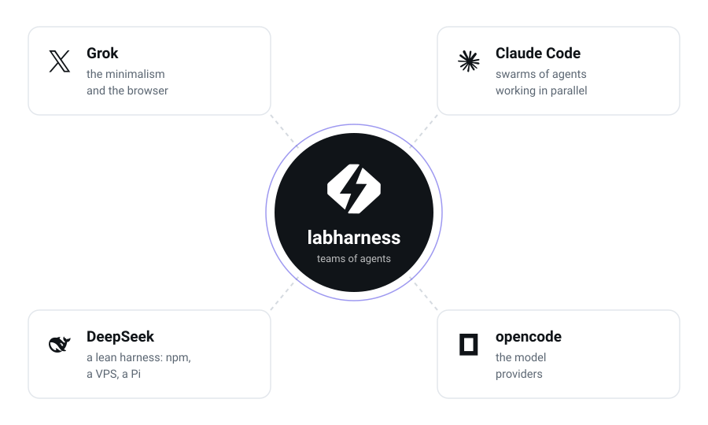

<p align="center">
  <picture>
    <source media="(prefers-color-scheme: dark)" srcset="assets/logo-dark.svg">
    
  </picture>
</p>

<h1 align="center">force agent</h1>

<p align="center">
  A coding agent that runs as a service on your machine and that you reach through
  the browser — with desktop reach: edit files, write and run scripts, an
  interactive terminal, long-running processes.
</p>

```
npm i -g force-agent
force service start
force pair                 # shows how to connect the browser
```

Or without installing anything permanent, with the same line in PowerShell, bash
and zsh:

```
npx -y force-agent@latest web
```

Repository: [`force-agent/force-agent`](https://github.com/force-agent/force-agent) ·
[labfy.dev](https://labfy.dev)

## Where it comes from

<picture>
  <source media="(prefers-color-scheme: dark)" srcset="assets/influences-dark.svg">
  
</picture>

Four ideas that already existed apart, and that only pay off together:

**The minimalism and the browser from Grok.** The surface is a tab, not an IDE.
You open a URL and you are inside the machine — no extension to install, no
workspace to configure, no second window for every single thing the agent does.

**The swarm of agents from Claude Code.** Real work is rarely one agent in
series. It is a fan-out: several agents attacking independent pieces at the same
time, and one of them stitching the result together at the end.

**The harness from DeepSeek.** It installs with `npm` and runs wherever you have
a machine — a $5 VPS, a Raspberry Pi on a shelf, your work laptop. One process,
one binary, no orchestrator wrapped around it.

**The providers from opencode.** 75+ model providers already mapped, along with
the session runtime and the in-browser terminal that come with them.

At the center of the four sits force agent.

## Agents, not sessions

Most tooling organizes work by **session**: one conversation, one history, one
context that grows until it bursts. force agent organizes by **agent**.

An agent here has an identity of its own, and carries:

- **Skills** — what it knows how to do, and when that knowledge applies.
- **Tools** — what it is allowed to touch, with permission declared per action.
- **Business context** — the domain it operates in, not just the file that
  happens to be open.

And agents come together into **teams**. A team attacks a problem in parallel,
each agent with its own slice, and the result comes back as a value — not as
more text piled into a single context. The session becomes an implementation
detail: what persists, evolves and specializes is the agent.

## What it does differently

**`rlm()` — a subagent as a function call.** Inside a confined Code Mode
program, `tools.agent.spawn()` returns the child's answer as a value of the
program, not as text in the parent's context:

```js
const findings = await Promise.all(
  files.map((f) => tools.agent.spawn({ task: `Audit ${f}` }))
)
return tools.agent.spawn({ task: `Synthesize: ${JSON.stringify(findings)}` })
```

Intermediate results stay in variables, which is the entire point. There is
`background: true` with `agent.wait/list/stop`, a concurrency semaphore and a
per-run spawn ceiling.

**Multi-agent approval gate.** Before a fan-out starts, a permission assertion
presents the phases, the agent count and the script. The gate asserts at
runtime, at the actual spawn — not from a static estimate, which is trivially
bypassed by a `.map()` over a helper function.

**Fail-closed posture.** The server refuses to bind on a reachable interface
without a usable credential — refuses with an error, not a warning. A password
made only of spaces does not count as configured. There is no CORS grant to any
third-party domain; the origin list is what protects PTY ticket issuance, which
is exempt from authentication because a browser cannot send a header on a
WebSocket upgrade.

**Deterministic mode.** Under a flag, every read of the host clock inside Code
Mode throws, so that a replay of the same program cannot diverge.

## Security — read before exposing

**There is no agent sandbox.** Anyone who authenticates against this URL can run
arbitrary commands with the permissions of the process. force agent **does not
solve** this, and no harness in this category does.

What it does is narrow the reach and keep unauthenticated callers out: mandatory
authentication for a reachable bind, an ordered permission policy with `ask` as
the default, and a restrictive `remote` preset for browser sessions. None of
that makes the shell safe.

If you are going to expose it to the internet, put an identity layer in front of
it (Cloudflare Access or equivalent), keep the server credential underneath that
layer, and treat the container or the machine as the real blast radius of a
compromise.

## Configuration

Variables use the `FORCE_AGENT_` prefix. Every earlier brand — `LABHARNESS_`,
`LABFY_`, `POWER_` — and the upstream `OPENCODE_` spelling stay honored, in that
order, so a deployment made under an older name keeps working.

| Variable | Effect |
|---|---|
| `FORCE_AGENT_SERVER_PASSWORD` | server credential |
| `FORCE_AGENT_BIN_PATH` | points at the executable (also honored by the service installers) |
| `FORCE_AGENT_DEV_CORS` | allows localhost as an origin, for development only |
| `FORCE_AGENT_CODEMODE_DETERMINISTIC` | blocks clock reads inside Code Mode |
| `FORCE_AGENT_CONCURRENCY` | ceiling on simultaneous subagents |

A variable with that prefix which the process does not recognize raises a
warning at startup, naming it exactly — failing silently was a real bug, and the
contract between the list and the call sites is checked by a lint in CI.

Directories follow XDG under `force-agent` (`~/.config/force-agent`, and so on).
Directories from the previous name are adopted on first run, so an update keeps
every session.

## Service

Recipes for the three platforms live in
[`packaging/service/`](packaging/service/): a systemd unit, a launchd
LaunchAgent and a Windows Scheduled Task — a Task and not a Service, because a
Service runs in session 0 and would write its state where the `force` in
your terminal cannot read it.

## Development

Requires [Bun](https://bun.sh) 1.3.14 or newer.

```
bun install
bun run packages/cli/script/build.ts --single    # binary for the current platform
bun run lint
bun run typecheck
```

## License

MIT — see [`LICENSE`](LICENSE).

Built on [opencode v2](https://github.com/anomalyco/opencode), also MIT, whose
original copyright notice is preserved in `LICENSE`. The other marks mentioned
here belong to their respective owners; the mention indicates design influence,
not affiliation or endorsement.
